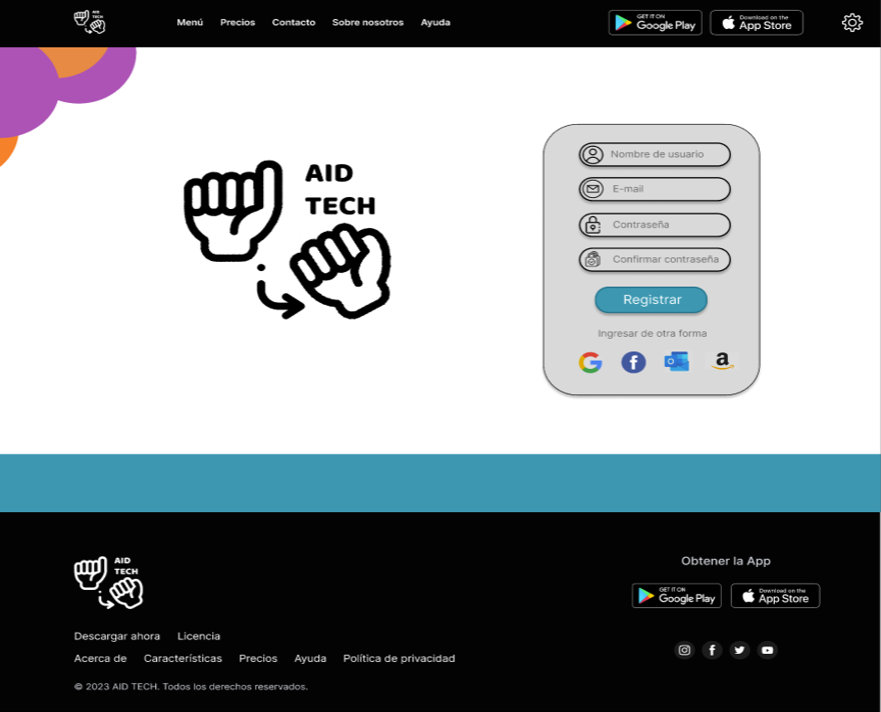
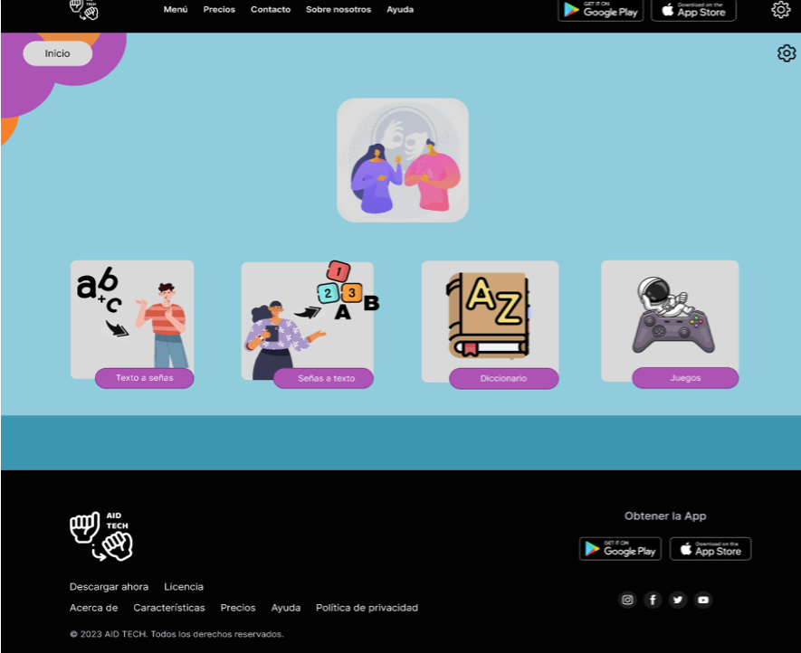
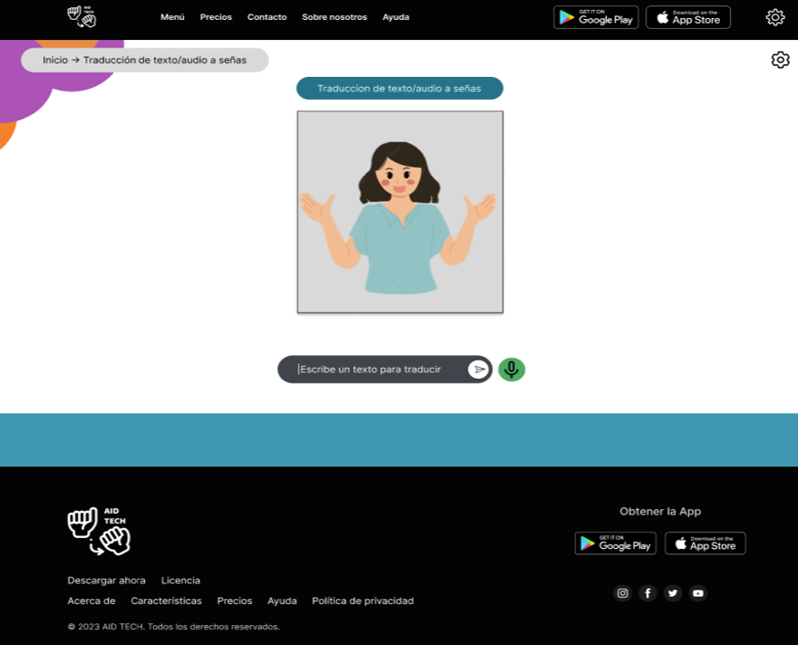
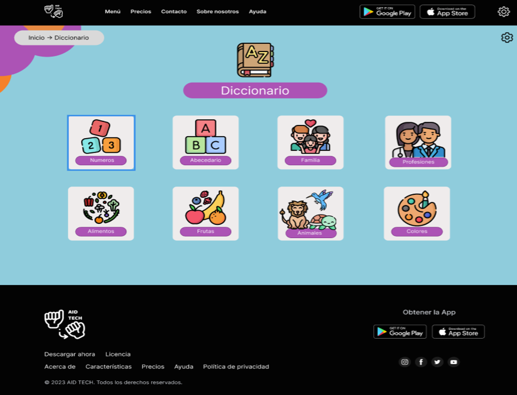
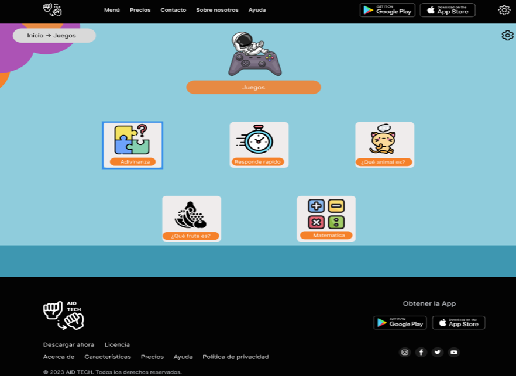
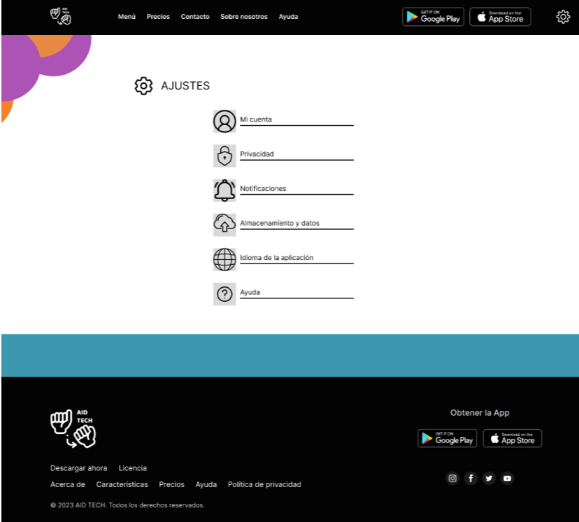

# AID TECH 

## 📜 Descripción del Proyecto

AID TECH es una aplicación web diseñada para mejorar la comunicación entre personas que utilizan el lenguaje de señas y aquellas que no lo hablan. La página web proporciona información sobre la aplicación y sus funcionalidades, utilizando HTML y CSS para su estructura y diseño.

## 🔧 Características de la Página Web

- **Landing Page**: Página principal con información sobre la aplicación.
- **Sección "Sobre Nosotros"**: Información sobre la misión y visión de AID TECH.
- **Sección "Precios"**: Detalles sobre las opciones de precios y sus beneficios.
- **Sección "Contacto"**: Formulario para que los usuarios puedan enviar consultas.
- **Sección "Descargas"**: Enlaces para descargar la aplicación móvil.
- **Página de Login**: Para que los usuarios puedan iniciar sesión.
- **Sección de Texto a Señas**: Permite la traducción de texto a lenguaje de señas.
- **Sección de Señas a Texto**: Permite la traducción de lenguaje de señas a texto.
- **Sección de Juegos**: Juegos interactivos para aprender y practicar el lenguaje de señas.
- **Sección de Diccionario**: Biblioteca de señas comunes y frases útiles, con búsqueda por palabra clave o categoría.

## 💻 Tecnologías Utilizadas

- **HTML**: Para la estructura de la página web.
- **CSS**: Para el diseño y presentación de la página web.
- **Figma**: Para el diseño de la interfaz de usuario (UI) y prototipado.
- **Visual Studio Code**: Editor de código utilizado para el desarrollo del proyecto.
- **GitHub**: Para la documentación y control de versiones del software.

## 📂 Estructura del Proyecto

- **Landing Page**: Página principal con información sobre la aplicación, opciones de navegación, y secciones como "Sobre Nosotros", "Precios", "Contacto", y "Descargas".
- **Página de Login**: Para que los usuarios puedan iniciar sesión.
- **Sección de Texto a Señas**: Permite la traducción de texto a lenguaje de señas.
- **Sección de Señas a Texto**: Permite la traducción de lenguaje de señas a texto.
- **Sección de Juegos**: Juegos interactivos para aprender y practicar el lenguaje de señas.
- **Sección de Diccionario**: Biblioteca de señas comunes y frases útiles, con búsqueda por palabra clave o categoría.

## 🚀 Instalación

1. Clona el repositorio:
   ```bash
   git clone https://github.com/AID-TECH-PROYECT/aid-tech.github.io
   ```

## 📸 Ejecución

### Página de Login



La ventana de login permite a los usuarios iniciar sesión en la plataforma. Con una navegación lateral intuitiva, los usuarios pueden acceder fácilmente a sus cuentas y comenzar su aprendizaje. Al rellenar todos los campos requeridos y loguearse, se garantiza una experiencia de usuario fluida y segura.

### Página de Inicio 



La página de inicio es el punto de partida para explorar todas las funcionalidades de la plataforma. Aquí, los usuarios pueden navegar por las diferentes secciones, obtener información sobre la aplicación y acceder a recursos útiles. La interfaz está diseñada para ser amigable y accesible, facilitando la interacción y el descubrimiento de las herramientas disponibles.

### Página de traducción de Texto a Señas



En esta ventana, los usuarios pueden introducir texto y recibir la traducción en lenguaje de señas. La funcionalidad está diseñada para ser rápida y precisa, utilizando tecnología avanzada para garantizar que la traducción sea clara y comprensible. Esta herramienta es especialmente útil para mejorar la comunicación entre personas que no conocen el lenguaje de señas y aquellas que lo utilizan.


### Página de traducción de Señas a Texto


Esta ventana permite a la plataforma capturar la imagen de la cámara para identificar la seña realizada y hacer la traducción respectiva. La tecnología de reconocimiento de imagen asegura que las señas sean interpretadas correctamente, facilitando la comunicación efectiva. Los usuarios pueden utilizar esta herramienta para traducir sus gestos en texto, mejorando la interacción en diversas situaciones.

### Página de Diccionario



La página de diccionario ofrece una biblioteca completa de señas comunes y frases útiles, organizadas por temáticas. Los usuarios pueden buscar palabras y aprender nuevas señas, utilizando la búsqueda por palabra clave o categoría. Esta sección es ideal para aquellos que desean expandir su vocabulario en lenguaje de señas y mejorar sus habilidades de comunicación.

### Página de Juegos



La sección de juegos proporciona una manera divertida e interactiva de aprender y practicar el lenguaje de señas. Los usuarios pueden elegir entre diferentes temáticas de juegos, diseñados para reforzar el aprendizaje y hacer que el proceso sea más entretenido. Esta herramienta es perfecta para aquellos que buscan una forma lúdica de mejorar sus habilidades en lenguaje de señas.


### Página de Ajustes



La ventana de ajustes permite a los usuarios personalizar su experiencia en la plataforma. Aquí, pueden cambiar configuraciones y visualizar las opciones disponibles para adaptar la aplicación a sus necesidades. Esta sección asegura que cada usuario pueda ajustar la plataforma según sus preferencias, mejorando la accesibilidad y la usabilidad.


